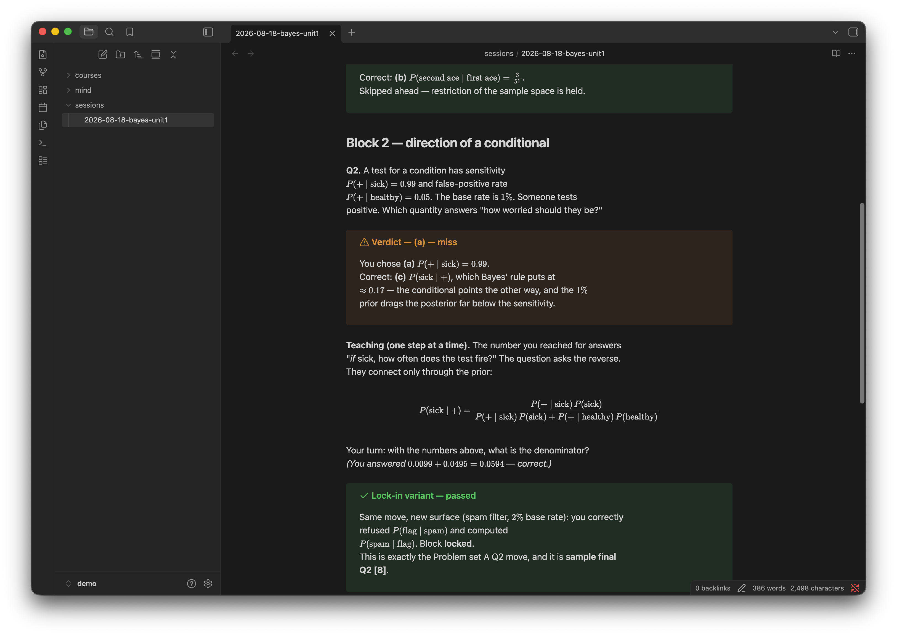

# λambda

Exam prep as a pair of Claude Code skills. One builds an index of your
course's assessed questions; the other runs quiz sessions against it,
teaches only what you miss, and keeps a running model of *why* you miss
things. State is a folder of markdown. Obsidian renders it live, LaTeX and
all, and you answer questions by ticking checkboxes in your notes.

I wrote this after seven years of tutoring and one too many students (and,
honestly, one too many of my own exams) proving the same point: re-reading
worked solutions feels like study and does almost nothing. The effect has
been in the literature since Roediger and Karpicke (2006) under the name
"testing effect". Retrieval practice beats re-exposure. Everyone nods at
this and then goes back to highlighting.

The loop here is Eero Alvar's, from [How I Use AI to Learn
Things](https://youtu.be/kzcI5F4tGiU): probe with multiple choice until you
find the edge of what the student holds, plan the path as a DAG, teach one
step at a time, verify before advancing. What I've added is memory and
motive. Memory: every miss is logged in a fixed schema and your past errors
seed future wrong options. Motive: every question is anchored to a real
past-paper question and the marks it carries.



## Install

```bash
git clone https://github.com/abaj8494/lambda-agent
cd lambda-agent && ./install.sh
```

This copies the two skills into `~/.claude/skills` and scaffolds a vault at
`~/lambda-vault` (pass a path to put it elsewhere). Open the vault in
Obsidian, or anything that renders callouts, mermaid and `$...$` math; the
exact requirements are three short contracts in [SPEC.md](SPEC.md).

Then, in Claude Code:

```
/lambda-map regression ~/uni/regression/tutorials ~/uni/regression/past-exams
/lambda hypothesis-testing
```

Use a frontier-tier model. The skill checks and will refuse a small one,
because the whole product is the quality of the wrong answers.

## What a session is like

Say the target is Bayes' rule. The session reads your `mind/` files first,
so it won't re-ask what you demonstrated last week. It splits the material
into blocks, orders them by marks at stake, and draws the plan as a mermaid
graph that updates as you go, with a running ETA.

Then it asks questions. Three plausible options plus "I don't know", which
is always available and treated as calibration, not failure. A student who
picks the sensitivity $P(+\mid \text{sick}) = 0.99$ when asked how worried
a positive patient should be has made the single most common error in
applied probability, and the session says so, walks the actual computation
(the posterior is about $0.17$ at a $1\%$ base rate), and then asks a
variant with the same structure and a different story. Nothing is marked
learned because you were taught it. Only a cold variant counts.

If you clear a block's questions, the block is skipped entirely. That is
the speed mechanism, and it's why a lecture you half-know takes twenty
minutes instead of two hours.

Misses get filed like this:

```markdown
> [!warning] Stalled at
> Answered "how worried after a positive test?" with the sensitivity
> $P(+\mid \text{sick})$ instead of the posterior $P(\text{sick}\mid +)$.

> [!tip] Missing move
> Say aloud which way the conditional points, then check whether the
> question asks for the reverse.
```

Known, stalled-at, missing move, which problems drill it, current status.
These atoms are the point of the system. A term of them is a map of your
head, and it is version-controlled, because the vault is just a git repo.

There's a mnemonic in the name if you want one: Locate, Ask, Miss, Bridge,
Drill, Advance. A completed example session, plan graph and all, is in
[`docs/demo/`](docs/demo/).

## The map

`/lambda-map <course> <folders>` reads your tutorial sheets and past papers
and writes a routing table: concept, the drill that teaches it, the exam
question it's worth marks on. Two deliberate restrictions. It indexes
question files only and refuses to open anything that looks like solutions,
so the tool can't degenerate into an answer key. And sessions never reuse
an assessed question verbatim; the move is kept, the numbers and the story
change. My university's exams went open book, which makes memorised answers
worth exactly zero. On-the-fly problem solving at exam pace is the only
thing left to train, so that's what this trains.

## Anki

Multiple choice is diagnosis, not retention. Free recall beats recognition
for long-term memory, and I didn't want this tool quietly cannibalising
anyone's flashcard practice, so the Anki integration is opt-in and
deliberately restrictive: the session offers cards only for concepts you've
actually locked, the fronts must demand generation ("derive...", "state...",
never options or true/false), and it pushes through AnkiConnect only after
you approve each card. If you don't use Anki, nothing happens.

## What this is and isn't

It's two SKILL.md files, a file-format spec, and an install script. There
is no server, no account, no telemetry; your course materials and your
mistakes stay on your machine. The checkbox-answer mechanism is a two-second
polling loop, which is inelegant and works fine. The skill format also
loads in pi and Codex CLI, though I only use it under Claude Code.

If you build a different renderer against SPEC.md, or find a place where
the protocol teaches badly, open an issue. Pedagogy bugs are bugs here.

## Credits

The probe/teach/verify loop is [Eero
Alvar's](https://youtu.be/kzcI5F4tGiU).
[Alvarmethod](https://github.com/vasanthsreeram/Alvarmethod) is a sibling
implementation of the same loop and predates this repo; if you want the
loop without the marks map and the misconception ledger, use that. The
testing-effect literature is a rabbit hole worth an afternoon: start with
Roediger & Karpicke (2006), *Test-enhanced learning*.

MIT, see [LICENSE](LICENSE).
