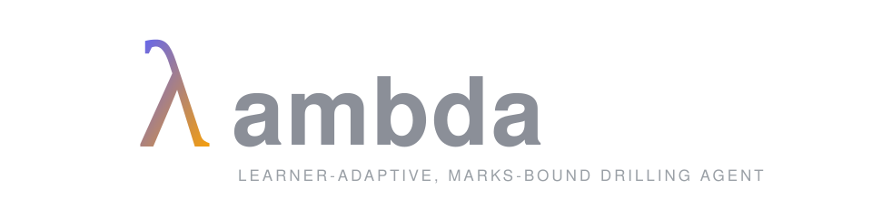
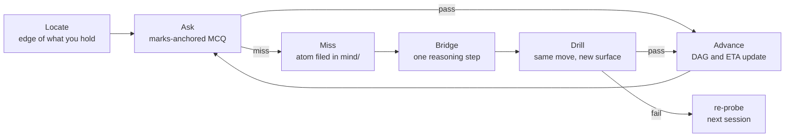

<p align="center">
  
</p>

<p align="center">
  <a href="https://github.com/abaj8494/lambda-agent/stargazers"></a>
  <a href="LICENSE"></a>
  <a href="skills/"></a>
  <a href="https://youtu.be/kzcI5F4tGiU"></a>
</p>

In essence, an agentic Recommender System that builds a map of your working knowledge on-disk 
based on course-content from University or School-work.

The agent constructs MCQ questions from PDFs that you give it and also interpolates new problems
for sub-topics that /you/ struggle with. The skill requires access to a frontier model and provides opportunity to ask questions in a REPL-like manner all throughout.

The poignance of this sophistication is packaged simply as a pair of Claude Code skills!

The first skill builds an index of your course's assessed questions whilst the other runs quiz sessions against it -- teaching you what you miss. The file-system keeps a running model of *why* you miss
things. 

*State* is a folder of markdown. Obsidian renders it live (like in Eero's video), LaTeX and
all. You answer questions by ticking checkboxes in your notes.

Note: all the questions are MCQ, and this will get you only so far. c.f. Roediger & Karpicke (2006)

The loop is Eero Alvar's, from [How I Use AI to Learn Things](https://youtu.be/kzcI5F4tGiU).
I've only added memory and motive for my Grad-school needs:
- Memory: every miss is logged in a fixed schema and past errors seed future wrong options. 
- Motive: every question is anchored to a real past-paper question and marks

The pipeline:




## Install

```bash
git clone https://github.com/abaj8494/lambda-agent
cd lambda-agent && ./install.sh
```

This copies the two skills into `~/.claude/skills` and scaffolds a vault at
`~/lambda-vault` (pass a path to put it elsewhere). Open the vault in
Obsidian, or anything that renders callouts, mermaid and `$...$` math; the
exact requirements are three contracts in [SPEC.md](SPEC.md).

Then, in Claude Code:

```
/lambda-map regression ~/uni/regression/tutorials ~/uni/regression/past-exams
/lambda hypothesis-testing
```

Tip: Use a frontier-tier model. 

## Example Session

Target : Bayes' rule.

The session reads your `mind/` files first, so it won't re-ask what you demonstrated last week. It then splits the material into blocks, orders them by marks at stake, and draws the plan as a mermaid graph that updates as you go, with a running ETA (so you don't overstudy).

Then it asks questions. 

If you get something wrong, the `skill` generates simpler questions and builds
back up to quizzing the same underlying concept with different clothes on.

Misses get filed like:

```markdown
> [!warning] Stalled at
> Answered "how worried after a positive test?" with the sensitivity
> $P(+\mid \text{sick})$ instead of the posterior $P(\text{sick}\mid +)$.

> [!tip] Missing move
> Say aloud which way the conditional points, then check whether the
> question asks for the reverse.
```

Known, stalled-at, missing move, which problems drill it, current status.
These atoms are the point of the system. A term of them is a map of your
head, and it is version-controlled, because the vault is just a git repo.

## The map

`/lambda-map <course> <folders>` reads your tutorial sheets and past papers
and writes a routing table: concept, drills to teach it, and the exam
question it's worth marks on. Courses arrive week by week, so re-run it
when new sheets drop: it reads its own source ledger and updates the map
in place. Solutions files are used to check marks and intended methods,
never shown to you.

## Anki

Multiple choice is diagnosis, not retention. Free recall beats recognition
for long-term memory. Anki integration is opt-in and
deliberately restrictive: the session offers cards only for concepts you've
actually locked, the fronts must demand generation ("derive...", "state...",
never options or true/false), and it pushes through AnkiConnect only after
you approve each card. If you don't use Anki, nothing happens.

## What's in the box:

- two SKILL.md files
- a file-format spec
- install script

No server, no account, no telemetry; your course materials and your
mistakes stay on your machine. The checkbox-answer mechanism is a two-second
polling loop, which is inelegant and works fine. The skill format also
loads in pi and Codex CLI, though I only use it under Claude Code.

Feel free to open issues. 

## Credits

The probe/teach/verify loop is [Eero Alvar's](https://youtu.be/kzcI5F4tGiU).
[Alvarmethod](https://github.com/vasanthsreeram/Alvarmethod) is a sibling
implementation of the same loop and predates this repo; if you want the
loop without the marks map and the misconception ledger, use that.


MIT, see [LICENSE](LICENSE).
