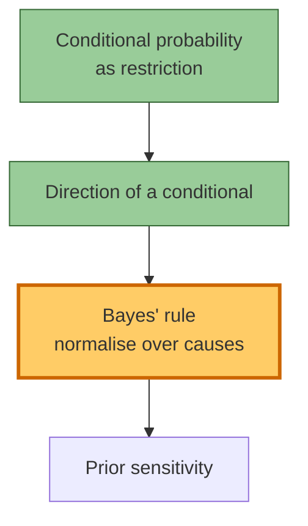

# λ session — bayes-basics Unit 1 — 2026-08-18

Target: Unit 1, Bayes' rule (timebox: 30 min).

**Progress:** 2/4 blocks · ~5 min/block · **ETA ≈ 10 min**

---

## Block 1 — conditional probability as restriction

> [!success] Verdict — (b)
> Correct: **(b)** $P(\text{second ace} \mid \text{first ace}) = \tfrac{3}{51}$.
> Skipped ahead — restriction of the sample space is held.

## Block 2 — direction of a conditional

**Q2.** A test for a condition has sensitivity
$P(+\mid \text{sick}) = 0.99$ and false-positive rate
$P(+\mid \text{healthy}) = 0.05$. The base rate is $1\%$. Someone tests
positive. Which quantity answers "how worried should they be?"

> [!warning] Verdict — (a) — miss
> You chose **(a)** $P(+\mid \text{sick}) = 0.99$.
> Correct: **(c)** $P(\text{sick} \mid +)$, which Bayes' rule puts at
> $\approx 0.17$ — the conditional points the other way, and the $1\%$
> prior drags the posterior far below the sensitivity.

**Teaching (one step at a time).** The number you reached for answers
"*if* sick, how often does the test fire?" The question asks the reverse.
They connect only through the prior:

$$P(\text{sick}\mid +) = \frac{P(+\mid \text{sick})\,P(\text{sick})}{P(+\mid \text{sick})\,P(\text{sick}) + P(+\mid \text{healthy})\,P(\text{healthy})}$$

Your turn: with the numbers above, what is the denominator?
*(You answered $0.0099 + 0.0495 = 0.0594$ — correct.)*

> [!success] Lock-in variant — passed
> Same move, new surface (spam filter, $2\%$ base rate): you correctly
> refused $P(\text{flag}\mid \text{spam})$ and computed
> $P(\text{spam}\mid \text{flag})$. Block **locked**.
> This is exactly the Problem set A Q2 move, and it is **sample final
> Q2 [8]**.

## Block 3 — Bayes' rule, normalising over all causes

**Q3.** Factory X makes $70\%$ of the widgets with a $2\%$ defect rate;
factory Y makes $30\%$ with a $6\%$ defect rate. A widget is defective.
What is $P(X \mid \text{defect})$?

- [ ] **(a)** $\dfrac{0.02}{0.02 + 0.06}$
- [ ] **(b)** $\dfrac{0.7 \times 0.02}{0.7 \times 0.02 + 0.3 \times 0.06}$
- [ ] **(c)** $0.7 \times 0.02$
- [ ] **(d)** I don't know

<!-- λt: probe-start 1755482400, block1 1755482710, block2 1755483350 -->
